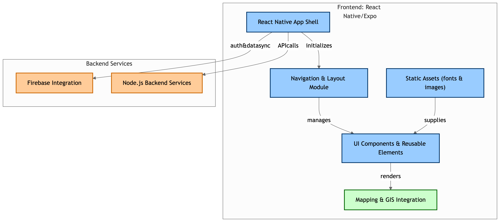

# KW FloodLink



KW FloodLink is a comprehensive web and mobile application designed to enhance community resilience and response during flooding disasters. This app was created during a hackathon and integrates advanced mapping, real-time reporting, and educational resources to address the growing issue of flooding, especially in regions like Kitchener-Waterloo.

---

## Features

- **Real-Time Reporting:** Users can submit reports on emergencies, hazards, and areas to avoid, helping authorities prioritize resources effectively.
- **Educational Resources:** Access courses and guides focused on disaster preparedness and environmental restoration.
- **Community Collaboration:** Facilitate donations, volunteering, and efficient resource distribution.
- **Interactive Mapping:** Visualize flood-affected areas and hazards using advanced GIS technology.

---

## Technologies Used

KW FloodLink was built using the following technologies:

### Frontend
- **React Native:** Cross-platform framework for building apps that run seamlessly on iOS, Android, and web.
- **Expo:** Enhances React Native development with tools and services for faster iteration.
- **ArcGIS SDK (@arcgis/core, @arcgis/map-components-react):** For interactive mapping and geospatial data visualization.
- **React Navigation:** Enables smooth navigation and intuitive user experience.
- **React-Leaflet:** For rendering interactive maps with Leaflet.
- **Vector Icons:** Used for enriching the user interface.

### Backend
- **Node.js:** Provides a scalable and efficient backend environment.

### Dependencies
- **Expo Libraries:** Including `expo-font`, `expo-splash-screen`, and `expo-status-bar` for enhanced app functionality.
- **React Native Firebase:** For integrating backend services such as authentication and database.

---

## Installation

Follow these steps to run KW FloodLink locally:

1. **Clone the repository:**
   ```bash
   git clone https://github.com/abdullahlali/FloodLink.git
   cd FloodLink
   ```
2. **Install dependencies:**
   ```bash
   npm install
   ```
3. **Start the development server:**
   ```bash
   expo start
   ```
4. **Run the app:**
   - Use an Android/iOS simulator or your physical device by scanning the QR code generated by Expo.

---

## Demo

The application includes a live demo showcasing its capabilities, such as:

- Submitting and viewing real-time flood reports.
- Navigating an interactive map of flood-affected areas.
- Accessing educational resources to prepare for and respond to flooding events.

---

## Contributions

KW FloodLink was developed by a dedicated team:

- Ryland Hill
- Abdullah Liaqat Ali
- Dhruv Charan
- Shaan Nair
- Fio Gandola

We welcome contributions to enhance the app. Feel free to fork the repository and submit pull requests!

---

## Acknowledgments

- Inspired by the increasing frequency and impact of flooding in Kitchener-Waterloo.
- Thanks to ArcGIS for providing powerful SDKs that made our mapping features possible.
- Developed as part of a hackathon to address real-world challenges.

---

## License

This project is licensed under the [MIT License](LICENSE).

---

## Contact

For inquiries, suggestions, or feedback, please contact abdullahliaqat.dev@gmail.com

---

## References

- [Kitchener-Waterloo Flooding Statistics](https://www.cbc.ca/news/canada/kitchener-waterloo/top-10-weather-waterloo-region-spring-flood-warm-fall-1.4460536)

